# Little Stars — Kids Learning Center

Landing page statis satu halaman untuk **Little Stars Kids Learning Center**, sebuah pusat pendidikan
anak usia dini. Dibangun tanpa build step dan tanpa dependency: Tailwind, Google Fonts, dan Font Awesome
dimuat dari CDN, seluruh JavaScript ditulis vanilla dalam satu blok `<script>`.

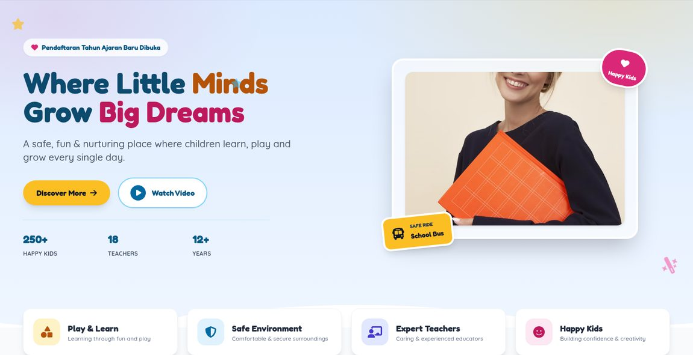

## Fitur

- **Hero section** dengan badge pendaftaran, tiga statistik kepercayaan, dan CTA ganda.
- **Feature highlights** — empat keunggulan utama (Play & Learn, Safe Environment, Expert Teachers, Happy Kids).
- **About** — cerita singkat sekolah dengan kartu statistik "12+ Years of Care".
- **Programs** — empat kelompok usia (Playgroup, Nursery, Junior KG, Senior KG) dengan badge rentang usia.
- **Activities** — empat kegiatan (Art & Craft, Music & Dance, Outdoor Play, Story Time) dalam grid lingkaran.
- **Gallery** — grid foto dengan caption dan efek zoom saat hover.
- **Booking form** — formulir tur sekolah dengan validasi per kolom.
- **Video modal** — pemutar video dengan focus trap dan tombol Escape.
- **Navigasi** — menu mobile yang dapat dibuka/tutup dan scroll-spy yang menandai seksi aktif.

## Tangkapan Layar

Tampilan penuh halaman dalam satu gambar:

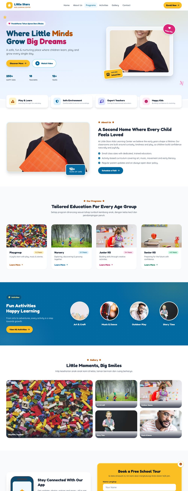

### Per Section

| Hero | About |
|---|---|
|  | 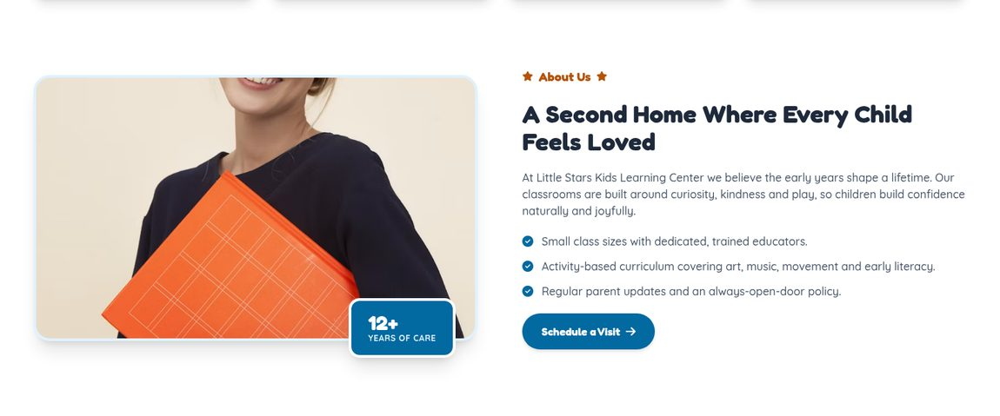 |

| Programs | Activities |
|---|---|
| 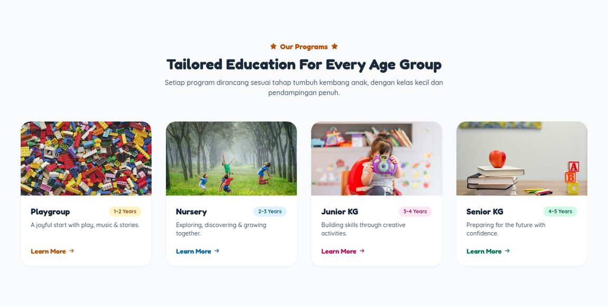 | 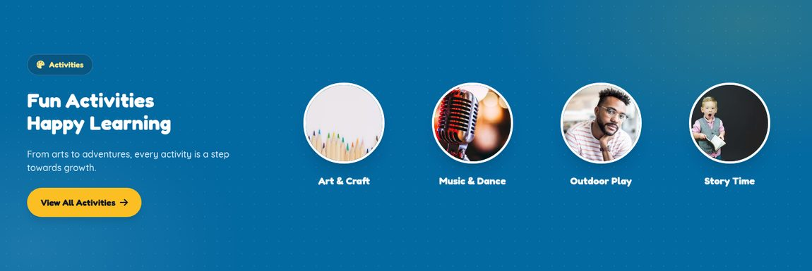 |

| Gallery | Booking Form |
|---|---|
| 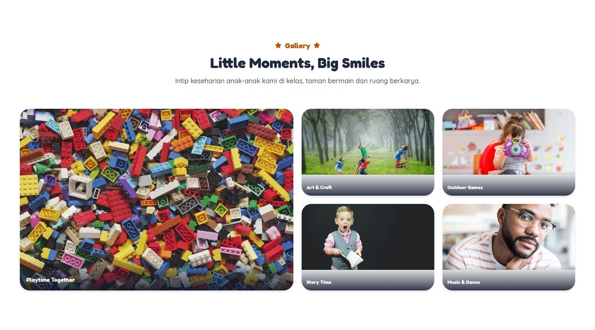 | 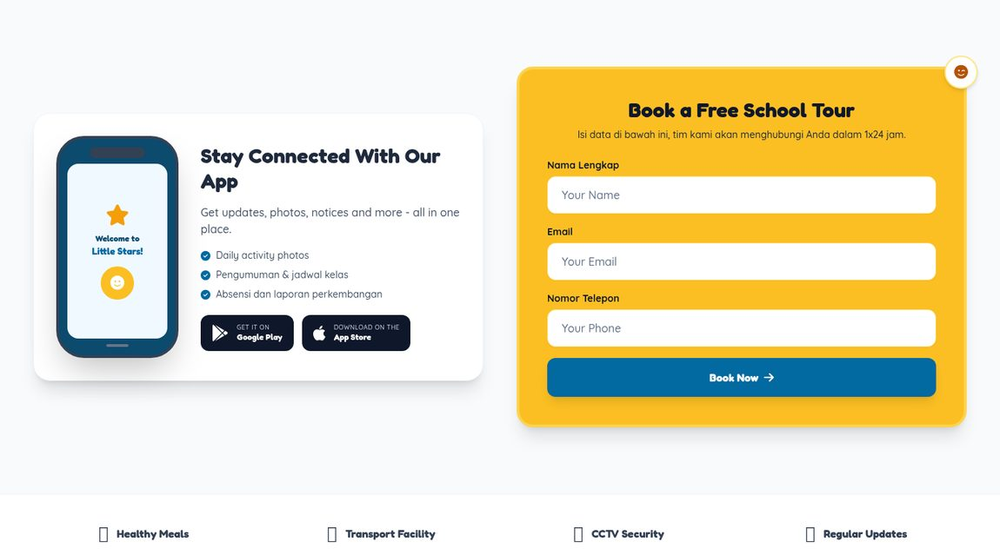 |

Footer:

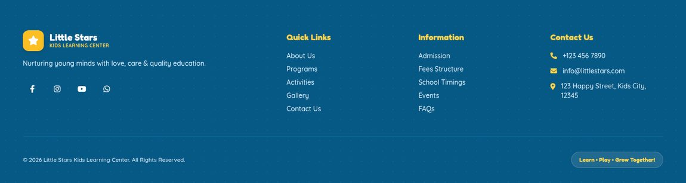

### Tampilan Mobile

Layout responsif pada lebar 390 px:

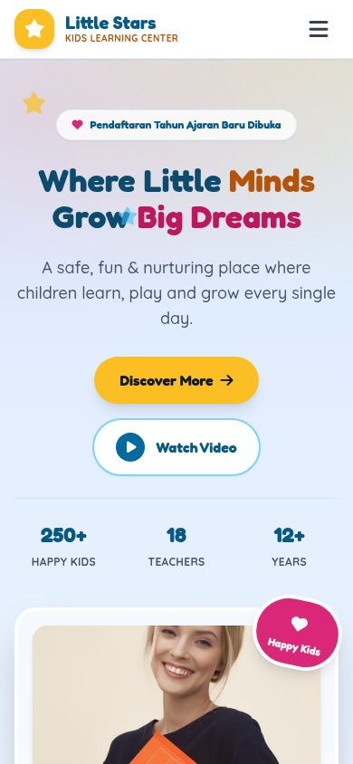

### Status Interaktif

**Validasi formulir** — pesan kesalahan muncul di bawah setiap kolom yang tidak valid, disertai border merah
dan `aria-invalid`:

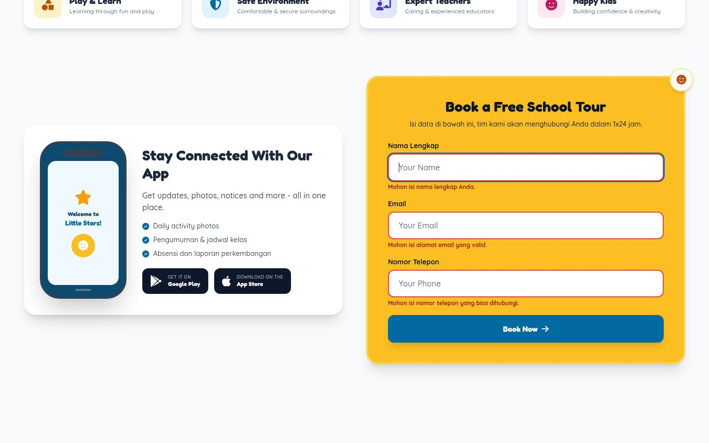

**Modal video** — iframe dimuat saat dibuka dan dikosongkan saat ditutup agar video berhenti:

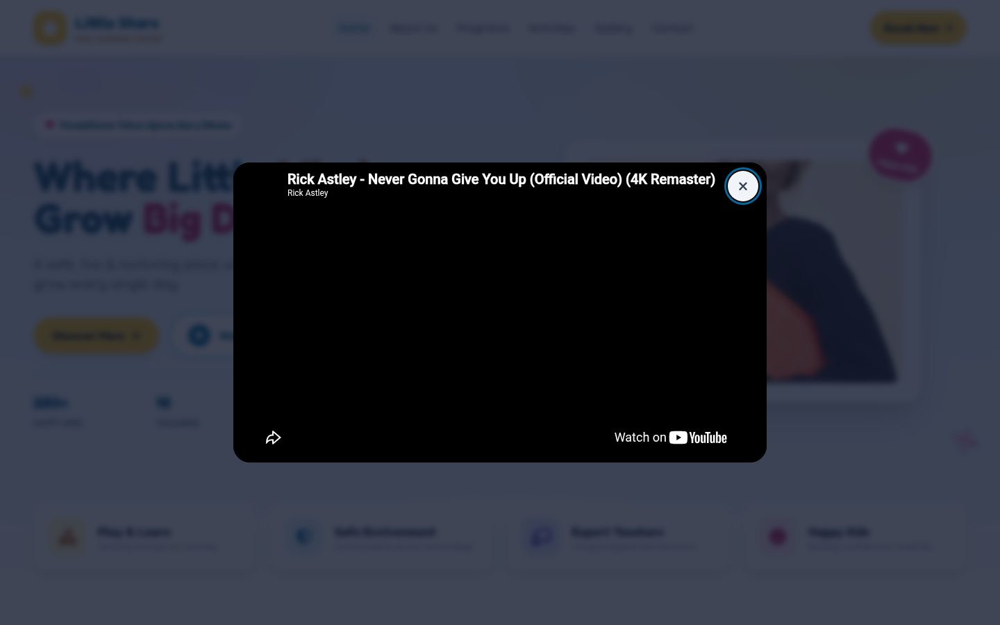

## Preview Lokal

Karena situs ini statis, cukup jalankan server HTTP sederhana dari root repo:

```bash
python3 -m http.server 12000
```

Lalu buka <http://localhost:12000/>.

Bisa juga langsung membuka `index.html` di browser, tetapi mode `file://` dapat memblokir sebagian
permintaan CDN, jadi server lokal lebih disarankan.

## Struktur Proyek

```
.
├── index.html              # seluruh situs (HTML + Tailwind config + CSS + JS)
├── AGENTS.md               # catatan konvensi repo untuk sesi berikutnya
└── docs/
    └── screenshots/        # gambar untuk README ini
```

## Teknologi

| Bagian | Digunakan |
|---|---|
| Styling | Tailwind CSS (CDN) dengan `tailwind.config` inline |
| Tipografi | Fredoka (heading) & Quicksand (body) dari Google Fonts |
| Ikon | Font Awesome 6 |
| Gambar | Unsplash |
| JavaScript | Vanilla, tanpa framework |

## Struktur Section

Setiap tautan navigasi menunjuk ke `id` yang sesuai:

`#home` · `#about` · `#programs` · `#activities` · `#gallery` · `#book-tour` · `#contact`

## Aksesibilitas

Rasio kontras dihitung, bukan diperkirakan. Beberapa kombinasi warna awal gagal WCAG AA dan sudah diganti:

| Elemen | Sebelum | Sesudah |
|---|---|---|
| Eyebrow / link amber | 2.15:1 | 5.02:1 |
| Teks footer | 3.57:1 | 6.59:1 |
| Judul footer | 2.84:1 | 5.25:1 |
| Link sky | 4.10:1 | 5.93:1 |
| Placeholder input | 2.56:1 | 4.76:1 |

Selain itu: focus ring yang terlihat, skip link "Lompat ke konten utama", elemen landmark semantik,
urutan heading yang benar, label formulir nyata dengan `aria-describedby` dan `aria-invalid`, focus trap
pada modal, `aria-current` pada navigasi scroll-spy, serta pembungkus `motion-safe:` untuk animasi agar
pengguna dengan preferensi *reduced motion* tidak terganggu.

## Catatan Penting

> **Formulir tur sekolah belum terhubung ke backend.**

Formulir saat ini hanya memvalidasi di sisi klien, menampilkan pesan sukses, lalu mereset dirinya.
Data yang diisi **tidak terkirim ke mana pun**. Sebelum situs dipakai publik, diperlukan:

1. Endpoint HTTPS dengan validasi di sisi server.
2. Proteksi CSRF/rate limiting untuk mencegah spam.
3. Kebijakan privasi, karena formulir mengumpulkan data pribadi (nama, email, nomor telepon).

## Kustomisasi

- **Warna** — ubah palet di blok `tailwind.config` dalam `index.html` (objek `colors.brand`).
  Perhatikan aturan kontras di atas sebelum mengganti warna teks.
- **Teks & harga** — semua konten ada langsung di `index.html`, tidak ada data terpisah.
- **Gambar** — ganti URL Unsplash. Setiap `` sudah memuat `alt`, `width`/`height`,
  `decoding="async"`, dan `loading="lazy"`.
- **Video** — ubah `VIDEO_SRC` di bagian bawah `index.html`.

## Verifikasi

- **Markup** — tidak ada tag menggantung/tidak tertutup, tidak ada `id` ganda, tidak ada anchor rusak.
- **Perilaku** — fungsi halaman dijalankan di headless Chromium: validasi kosong/valid/tidak valid,
  toggle menu, buka/tutup modal beserta pembersihan iframe, dan tahun footer.
- **Responsif** — tidak ada overflow horizontal pada 390/768/1440 px; seluruh 15 gambar termuat dengan `alt`.

Detail konvensi dan resep pengujian tercatat di [`AGENTS.md`](AGENTS.md) agar perbaikan tidak terulang kembali.

---

Dibuat dengan bantuan AI agent ([OpenHands](https://github.com/All-Hands-AI/OpenHands)) atas nama pemilik repo.